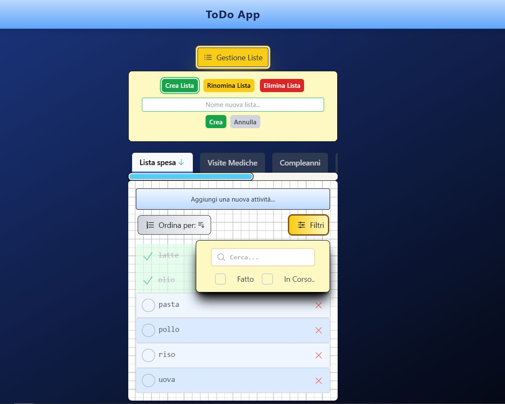

[](https://app.netlify.com/sites/todo-app-davide-martinco/deploys)
[](https://opensource.org/licenses/MIT)
[](https://reactjs.org/)
[](https://nextjs.org/)
[](https://www.typescriptlang.org/)
[](https://tailwindcss.com/)


# 📝 Todo List App - Organizza la Tua Giornata con Efficacia

**Un'applicazione web moderna e intuitiva per la gestione delle tue attività, costruita con React, TypeScript e Tailwind CSS, con persistenza dei dati grazie a localStorage.**



## ✨ Panoramica

"Todo List App" è una soluzione semplice ma potente per tenere traccia delle tue attività e aumentare la tua produttività.  Sviluppata utilizzando le più moderne tecnologie web come React per l'interfaccia utente dinamica, TypeScript per la robustezza del codice e Tailwind CSS per uno styling rapido e responsivo, questa app offre un'esperienza utente fluida e piacevole.  Le tue liste di attività sono salvate direttamente nel browser grazie a `localStorage`, garantendo che i tuoi dati siano sempre disponibili e privati, anche dopo aver chiuso la pagina.

## 🚀 Funzionalità Principali

*   **Creazione, Lettura, Aggiornamento ed Eliminazione (CRUD) di Attività:**
    *   Aggiungi rapidamente nuove attività alla tua lista con descrizioni dettagliate.
    *   Visualizza facilmente la tua lista di attività, sia completate che in sospeso.
    *   Modifica le descrizioni delle attività per mantenere le tue liste sempre aggiornate.
    *   Elimina attività non più necessarie con un'animazione di scorrimento laterale intuitiva.

*   **Gestione Avanzata delle Attività:**
    *   **Contrassegna le Attività come Complete:**  Indica visivamente le attività completate per monitorare i tuoi progressi.
    *   **Ricerca Potente:**  Trova rapidamente attività specifiche all'interno delle tue liste grazie alla funzionalità di ricerca testuale.
    *   **Persistenza Dati Locale (localStorage):**  Le tue attività sono salvate in modo sicuro e privato nel tuo browser e saranno disponibili anche al riavvio o alla chiusura della pagina.
    *   **Layout Responsivo:**  L'applicazione è progettata per funzionare perfettamente su desktop e dispositivi mobili, adattandosi a diverse dimensioni dello schermo.
    *   **Word Break:** Gestione elegante di parole molto lunghe, evitando overflow e mantenendo un layout pulito e leggibile.

## 🛠️ Tecnologie Utilizzate

*   **Frontend:**
    *   **[React](https://reactjs.org/)**:  Libreria JavaScript per la costruzione di interfacce utente dinamiche e reattive.
    *   **[TypeScript](https://www.typescriptlang.org/)**:  Superset di JavaScript che aggiunge tipizzazione statica per un codice più robusto e manutenibile.
    *   **[Tailwind CSS](https://tailwindcss.com/)**:  Framework CSS utility-first per uno styling rapido, responsivo e personalizzabile.
    *   **[Heroicons](https://heroicons.com/)**:  Libreria di icone SVG per un'interfaccia utente moderna e intuitiva.

## ⚙️ Installazione e Utilizzo (Sviluppo Locale)

Se desideri eseguire l'applicazione in locale per sviluppo o test:

1.  **Clona il repository:**
    ```bash
    git clone [https://github.com/davide017017/ToDo-App](https://github.com/davide017017/ToDo-App)
    cd [nome della cartella del repository]
    ```

2.  **Installa le dipendenze:**
    ```bash
    npm install  # oppure yarn install
    ```

3.  **Avvia l'applicazione in modalità sviluppo:**
    ```bash
    npm start    # oppure yarn start
    ```

    L'applicazione sarà disponibile all'indirizzo `http://localhost:3000` (o un'altra porta indicata nel terminale).

## 🌐 Demo Online

Puoi provare la "Todo List App" direttamente online tramite Netlify:

[Link alla tua applicazione Netlify -  `https://todo-app-davide-martinco.netlify.app/` oppure `https://app.netlify.com/sites/todo-app-davide-martinco/deploys` ]

## 📜 Licenza

Questo progetto è distribuito sotto la [Licenza MIT](LICENSE).

## 🧑‍💻 Autore

[davide017017 - Davide Martinco] - [[Link al tuo profilo GitHub o Portfolio (opzionale)](https://github.com/davide017017)]

**Realizzato con ❤️ e codice da davide017017**
